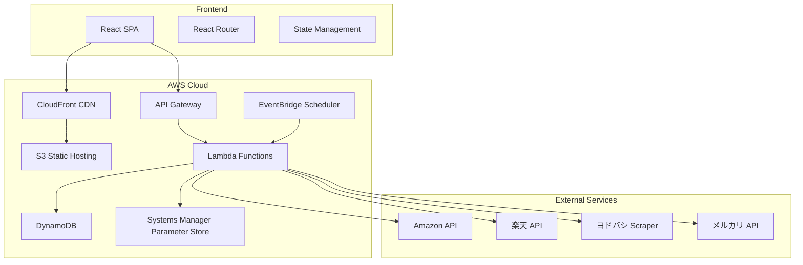

# Design Document

## Overview

トレイルランニングシューズ価格比較サイトは、サーバーレスアーキテクチャを採用したモダンな Web アプリケーションです。React ベースの SPA（Single Page Application）フロントエンドと、AWS 上に構築されたバックエンド API で構成されます。初期フェーズでは、サロモン製品に焦点を当て、4 つの主要 EC プラットフォーム（Amazon、楽天、ヨドバシ、メルカリ）での価格情報を事前取得・キャッシュし、高速な価格比較体験を提供します。

## Architecture

### System Architecture Diagram



### Architecture Layers

1. **Presentation Layer (Frontend)**

   - React 18+ with TypeScript
   - Vite for build tooling
   - TailwindCSS for styling
   - React Query for server state management

2. **API Layer**

   - AWS API Gateway (REST API)
   - Lambda authorizer for future authentication
   - CORS configuration for frontend access

3. **Business Logic Layer**

   - AWS Lambda functions (Node.js 20.x)
   - Modular function design per domain

4. **Data Layer**

   - DynamoDB for product and price data
   - Single-table design pattern
   - GSI for query optimization

5. **Integration Layer**

   - Price scraping/API integration services
   - Affiliate link generation utilities

6. **Scheduling Layer**
   - EventBridge Scheduler for periodic price updates
   - Configurable update frequency (default: every 6 hours)

## Components and Interfaces

### Frontend Components

#### 1. ProductList Component

```typescript
interface ProductListProps {
  category?: string;
  brand?: string;
}

interface Product {
  id: string;
  name: string;
  modelNumber: string;
  brand: string;
  imageUrl: string;
  officialUrl: string;
  category: string;
}
```

**Responsibilities:**

- Display grid/list of products
- Handle loading and error states
- Implement responsive layout
- Support filtering and sorting

#### 2. PriceComparison Component

```typescript
interface PriceComparisonProps {
  productId: string;
}

interface PriceData {
  platform: "amazon" | "rakuten" | "yodobashi" | "mercari";
  price: number | null;
  availability: "in_stock" | "out_of_stock" | "not_found";
  productUrl: string;
  affiliateUrl: string;
  lastUpdated: string;
}
```

**Responsibilities:**

- Fetch and display price data for all platforms
- Highlight lowest price
- Show savings amount
- Display last updated timestamp
- Handle affiliate link clicks

#### 3. PlatformCard Component

```typescript
interface PlatformCardProps {
  platform: string;
  priceData: PriceData;
  isLowestPrice: boolean;
}
```

**Responsibilities:**

- Display platform logo and name
- Show price with currency formatting
- Display availability status
- Render affiliate link button
- Apply visual highlight for lowest price

#### 4. ProductDetail Component

```typescript
interface ProductDetailProps {
  productId: string;
}
```

**Responsibilities:**

- Display product information
- Show official product link
- Embed PriceComparison component
- Handle product not found state

### Backend API Endpoints

#### 1. GET /products

```typescript
// Response
{
  products: Product[];
  nextToken?: string;
}
```

**Purpose:** Retrieve list of products with pagination

#### 2. GET /products/{productId}

```typescript
// Response
{
  product: Product;
}
```

**Purpose:** Get detailed product information

#### 3. GET /products/{productId}/prices

```typescript
// Response
{
  productId: string;
  prices: PriceData[];
  lastUpdated: string;
}
```

**Purpose:** Retrieve current price data for all platforms

#### 4. POST /admin/products (Future)

```typescript
// Request
{
  name: string;
  modelNumber: string;
  brand: string;
  imageUrl: string;
  officialUrl: string;
  category: string;
}
```

**Purpose:** Add new product (admin only)

### Lambda Functions

#### 1. GetProductsFunction

- **Trigger:** API Gateway GET /products
- **Purpose:** Query products from DynamoDB
- **Implementation:** Scan with filter expressions, pagination support

#### 2. GetProductDetailFunction

- **Trigger:** API Gateway GET /products/{productId}
- **Purpose:** Retrieve single product details

#### 3. GetPricesFunction

- **Trigger:** API Gateway GET /products/{productId}/prices
- **Purpose:** Fetch cached price data from DynamoDB

#### 4. UpdatePricesFunction

- **Trigger:** EventBridge Scheduler (every 6 hours)
- **Purpose:** Scrape/fetch prices from all platforms and update DynamoDB
- **Implementation:**
  - Iterate through all products
  - Call platform-specific scrapers/APIs in parallel
  - Update DynamoDB with new price data
  - Log errors for failed updates

#### 5. AmazonPriceService

- **Integration:** Amazon Product Advertising API (PA-API 5.0)
- **Fallback:** Web scraping if API unavailable

#### 6. RakutenPriceService

- **Integration:** 楽天商品検索 API

#### 7. YodobashiPriceService

- **Integration:** Web scraping (Puppeteer/Playwright)

#### 8. MercariPriceService

- **Integration:** Web scraping or unofficial API

## Data Models

### DynamoDB Single Table Design

**Table Name:** `PriceComparisonTable`

**Primary Key:**

- PK (Partition Key): String
- SK (Sort Key): String

**GSI1:**

- GSI1PK (Partition Key): String
- GSI1SK (Sort Key): String

### Entity Patterns

#### Product Entity

```
PK: PRODUCT#{productId}
SK: METADATA
Attributes:
  - entityType: "product"
  - name: string
  - modelNumber: string
  - brand: string
  - imageUrl: string
  - officialUrl: string
  - category: string
  - createdAt: string
  - updatedAt: string

GSI1PK: BRAND#{brand}
GSI1SK: PRODUCT#{productId}
```

#### Price Entity

```
PK: PRODUCT#{productId}
SK: PRICE#{platform}
Attributes:
  - entityType: "price"
  - platform: string
  - price: number | null
  - availability: string
  - productUrl: string
  - lastUpdated: string
  - lastChecked: string
  - errorMessage?: string

GSI1PK: PLATFORM#{platform}
GSI1SK: UPDATED#{lastUpdated}
```

#### Affiliate Config Entity

```
PK: CONFIG
SK: AFFILIATE#{platform}
Attributes:
  - entityType: "affiliateConfig"
  - platform: string
  - affiliateId: string
  - trackingTag: string
  - urlTemplate: string
  - isActive: boolean
```

### Access Patterns

1. **Get all products** → Scan with filter PK begins_with "PRODUCT#"
2. **Get product by ID** → Query PK=PRODUCT#{id}, SK=METADATA
3. **Get prices for product** → Query PK=PRODUCT#{id}, SK begins_with "PRICE#"
4. **Get products by brand** → Query GSI1 where GSI1PK=BRAND#{brand}
5. **Get stale prices** → Query GSI1 where GSI1PK=PLATFORM#{platform} and GSI1SK < threshold

## Error Handling

### Frontend Error Handling

1. **Network Errors**

   - Display user-friendly error message
   - Provide retry button
   - Log error to console (development) or monitoring service (production)

2. **API Errors**

   - 404: Show "Product not found" message
   - 500: Show "Service temporarily unavailable"
   - Timeout: Show "Request timed out, please try again"

3. **Data Validation Errors**
   - Validate data structure before rendering
   - Fallback to default values for missing fields
   - Log validation errors

### Backend Error Handling

1. **Lambda Function Errors**

   - Wrap all logic in try-catch blocks
   - Return standardized error responses
   - Log errors to CloudWatch with context

2. **DynamoDB Errors**

   - Implement exponential backoff for throttling
   - Handle ProvisionedThroughputExceededException
   - Validate data before write operations

3. **External API/Scraping Errors**

   - Implement timeout (30 seconds max)
   - Retry logic with exponential backoff (max 3 retries)
   - Store error state in DynamoDB
   - Continue processing other platforms on failure
   - Alert on consecutive failures

4. **Error Response Format**

```typescript
{
  error: {
    code: string;
    message: string;
    details?: any;
  }
}
```

## Testing Strategy

### Frontend Testing

1. **Unit Tests (Vitest)**

   - Component rendering tests
   - Utility function tests
   - State management logic tests
   - Target: 70%+ coverage for critical paths

2. **Integration Tests (React Testing Library)**

   - User interaction flows
   - API integration with mock server (MSW)
   - Routing tests

3. **E2E Tests (Playwright)**
   - Critical user journeys
   - Price comparison flow
   - Responsive design validation
   - Affiliate link functionality

### Backend Testing

1. **Unit Tests (Jest)**

   - Lambda handler logic
   - Price scraping/API integration functions
   - Affiliate URL generation
   - Data transformation utilities
   - Target: 80%+ coverage

2. **Integration Tests**

   - DynamoDB operations with local DynamoDB
   - API Gateway integration
   - EventBridge trigger simulation

3. **Contract Tests**
   - Validate external API response structures
   - Mock external services for consistent testing

### Performance Testing

1. **Frontend Performance**

   - Lighthouse CI in build pipeline
   - Target: Performance score > 90
   - First Contentful Paint < 1.5s
   - Time to Interactive < 3s

2. **Backend Performance**
   - Lambda cold start optimization
   - API response time < 500ms (p95)
   - DynamoDB query optimization

### Accessibility Testing

1. **Automated Testing**

   - axe-core integration in component tests
   - WCAG 2.1 AA compliance checks

2. **Manual Testing**
   - Keyboard navigation
   - Screen reader compatibility
   - Color contrast validation

## Security Considerations

1. **API Security**

   - HTTPS only
   - CORS configuration
   - Rate limiting via API Gateway
   - Input validation and sanitization

2. **Secrets Management**

   - Store affiliate IDs in Systems Manager Parameter Store
   - Store API keys in Secrets Manager
   - Never expose secrets in frontend code

3. **Data Privacy**
   - No PII collection in initial phase
   - Comply with affiliate program terms of service
   - Implement robots.txt and respect scraping policies

## Deployment Strategy

### Infrastructure as Code

- AWS CDK (TypeScript) for infrastructure definition
- Separate stacks for different environments (dev, prod)

### CI/CD Pipeline

1. **Frontend Pipeline**

   - Build and test on push to main
   - Deploy to S3
   - Invalidate CloudFront cache

2. **Backend Pipeline**
   - Run tests
   - Package Lambda functions
   - Deploy via CDK
   - Run smoke tests

### Environments

- **Development:** Manual deployments, relaxed rate limits
- **Production:** Automated deployments from main branch, strict monitoring

## Monitoring and Observability

1. **CloudWatch Metrics**

   - Lambda invocation count, duration, errors
   - API Gateway request count, latency, 4xx/5xx errors
   - DynamoDB read/write capacity usage

2. **CloudWatch Logs**

   - Structured logging in Lambda functions
   - Log retention: 30 days

3. **Alarms**

   - Lambda error rate > 5%
   - API Gateway 5xx error rate > 1%
   - Price update function failures

4. **Frontend Monitoring**
   - Error tracking (e.g., Sentry)
   - Performance monitoring (e.g., Web Vitals)
   - User analytics (optional, privacy-focused)

## Future Enhancements

### Phase 2: Search Functionality

- Implement OpenSearch for full-text search
- Add search API endpoint
- Create search UI component

### Phase 3: AI Integration

- Integrate with Amazon Bedrock or OpenAI API
- Implement recommendation engine
- Add conversational search interface
- Personalized product suggestions based on user preferences

### Phase 4: Expanded Coverage

- Add more brands and categories
- Support additional e-commerce platforms
- International market support
